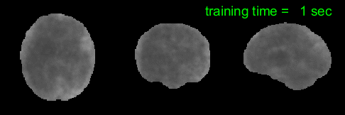
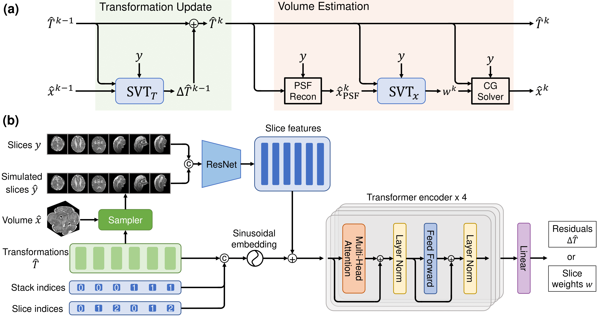
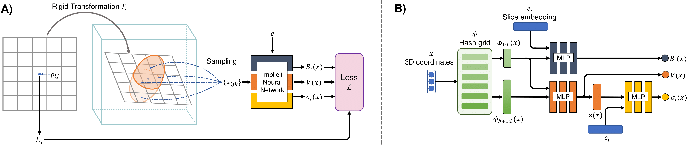

# NeSVoR: **Ne**ural **S**lice-to-**Vo**lume **R**econstruction

NeSVoR is a package for GPU-accelerated slice-to-volume reconstruction.

This package is the accumulation of the following works:

\[1\] SVoRT: Iterative Transformer for Slice-to-Volume Registration in Fetal Brain MRI ([Springer](https://link.springer.com/chapter/10.1007/978-3-031-16446-0_1) | [Arxiv](https://arxiv.org/abs/2206.10802))

\[2\] NeSVoR: Implicit Neural Representation for Slice-to-Volume Reconstruction in MRI ([TechRxiv](https://www.techrxiv.org/articles/preprint/NeSVoR_Implicit_Neural_Representation_for_Slice-to-Volume_Reconstruction_in_MRI/21398868/1))

<p align="center">
   
</p>
<p align="center"><p align="center">

<!-- toc -->
<!--
  - [Slice-to-Volume Registration Transformers (SVoRT)](#slice-to-volume-registration-transformers-svort)
  - [Neural Slice-to-Volume Reconstruction (NeSVoR)](#neural-slice-to-volume-reconstruction-nesvor) -->
- [Overview](#overview)
- [Installation](#installation)
  - [From Source](#from-source)
    - [Prerequisites](#prerequisites)
    - [Get the NeSVoR Source](#get-the-nesvor-source)
    - [Install Dependencies](#install-dependencies)
    - [Install NeSVoR](#install-nesvor)
  - [Docker Image](#docker-image)
    - [Install Docker and NVIDIA Container Toolkit](#install-docker-and-nvidia-container-toolkit)
    - [Download and Run NeSVoR Image](#download-and-run-nesvor-image)
- [Usage](#usage)
  - [Reconstruction](#reconstruction)
  - [Registration](#registration)
  - [Sample Volume](#sample-volume)
  - [Sample Slices](#sample-slices) <!-- - [Resources](#resources) -->
- [Cite Our Work](#cite-our-work)

<!-- tocstop -->

## Overview

NeSVoR is a deep learning package for solving slice-to-volume reconstruction problems (i.e., reconstructing a 3D isotropic high-resolution volume from a set of motion-corrupted low-resolution slices) with application to fetal/neonatal brain MRI, which provides
- Motion correction by mapping 2D slices to a 3D canonical space using [Slice-to-Volume Registration Transformers (SVoRT)](https://link.springer.com/chapter/10.1007/978-3-031-16446-0_1).
- Volumetric reconstruction of multiple 2D slices using implicit neural representation ([NeSVoR](https://www.techrxiv.org/articles/preprint/NeSVoR_Implicit_Neural_Representation_for_Slice-to-Volume_Reconstruction_in_MRI/21398868/1)).

<!--### Slice-to-Volume Registration Transformers (SVoRT)-->

<p align="center">
   
</p>
<p align="center">Figure 1. SVoRT: an iterative Transformer for slice-to-volume registration. (a) The k-th iteration of SVoRT. (b) The detailed network architecture of the SVT module.<p align="center">

<!--### Neural Slice-to-Volume Reconstruction (NeSVoR)-->

<p align="center">
   
</p>
<p align="center">Figure 2. NeSVoR: A) The forward imaging model in NeSVoR. B) The architecture of the implicit neural network in NeSVoR.<p align="center">

## Installation

### From Source

#### Prerequisites

If you are installing from source, you will need:
- An NVIDIA GPU
- Python 3.8 or later;
- GCC/G++ 7.5 or higher;
- CUDA v10.2 or higher;
- CMake v3.21 or higher.

see [tiny-cuda-nn](https://github.com/NVlabs/tiny-cuda-nn) for more on prerequisites

#### Get the NeSVoR Source

```
git clone https://github.com/daviddmc/NeSVoR
cd NeSVoR
```

#### Install Dependencies

```
pip install -r requirements.txt
```
Install PyTorch extension of [tiny-cuda-nn](https://github.com/NVlabs/tiny-cuda-nn). Make sure the installed CUDA version mismatches the version that was used to compile PyTorch. Then, run the following command (see [this](https://github.com/NVlabs/tiny-cuda-nn#pytorch-extension) for more details)
```
pip install git+https://github.com/NVlabs/tiny-cuda-nn/#subdirectory=bindings/torch
```

#### Install NeSVoR.

```
pip install .
```

### Docker Image

Coming soon!

<!--
#### Install Docker and NVIDIA Container Toolkit

You may follow this [guide](https://docs.nvidia.com/datacenter/cloud-native/container-toolkit/install-guide.html) to install Docker and NVIDIA Container Toolkit

#### Download and Run NeSVoR Image

```
docker pull junshenxu/nesvor:latest
docker run  --gpus '"device=0"' -it junshenxu/nesvor:latest
```
Note: our image was built with CUDA 11.6.
-->

## Usage

NeSVoR currently supports the following commands.

`nesvor reconstruct`: reconstruct a 3D volume (i.e., train a NeSVoR model) from either multiple stacks of slices (NIfTI) or a set of motion-corrected slices (the output of `register`).

`nesvor register`: register stacks of slices using a pretrained SVoRT model.

`nesvor sample-volume`: sample a volume from a trained NeSVoR model.

`nesvor sample-slices`: simulate slices from a trained NeSVoR model.

run `nesvor <command> -h` for a full list of parameters of a command.

### Reconstruction

#### Reconstruct from Mutiple Stacks of Slices

The `reconstruct` command can be used to reconstruct a 3D volume from `N` stacks of 2D slices (in NIfTI format, i.e. `.nii` or `.nii.gz`). 

A basic usage of `reconstruct` is as follows, where `mask-i.nii.gz` is the ROI mask of the i-th input stack.
```
nesvor reconstruct \
--input-stacks stack-1.nii.gz ... stack-N.nii.gz \
--stack-masks mask-1.nii.gz ... mask-N.nii.gz \
--output-volume volume.nii.gz
```

A more elaborate example could be 
```
nesvor reconstruct \
--input-stacks stack-1.nii.gz ... stack-N.nii.gz \
--stack-masks mask-1.nii.gz ... mask-N.nii.gz \
--thicknesses <thick-1> ... <thick-N> \
--output-volume volume.nii.gz \
--output-resolution 0.8 \
--output-model model.pt \
--weight-image 1.0 \
--image-regularization edge \
--delta 0.2 \
--n-iter 5000 \
--level-scale 1.38 \
--coarsest-resolution 16.0 \
--finest-resolution 0.5 \
--n-levels-bias 0 \
--n-samples 128
```
Run `nesvor reconstruct --h` to see the meaning of each parameter.

Given multiple stacks at inputs, `reconstruct` first corrects the motion in the input stacks using SVoRT (the same as what `register` did), and then trains a NeSVoR model that implicitly represent the underlying 3D volume, from which a discretized volume (i.e., a 3D tensor) can be sampled.

#### Reconstruct from Motion-Corrected Slices

`reconstruct` can also take a folder of motion-corrected slices as inputs. 
```
nesvor reconstruct \
--input-slices <path-to-slices-folder> \
--output-volume volume.nii.gz
```
This enables the separation of registration and reconstruction. That is, you may first run `register` to perform motion correction, and then use `reconstruct` to reconstruct a volume from a set of motion-corrected slices.

### Registration
`register` takes mutiple stacks of slices as inputs, performs motion correction, and then saves the motion-corrected slices to a folder.
```
nesvor register \
--input-stacks stack-1.nii.gz ... stack-N.nii.gz \
--stack-masks mask-1.nii.gz ... mask-N.nii.gz \
--registration <method> \
--output-slices <path-to-save-output-slices>
```
`register` currently supports the following methods:
- `svort`: the full SVoRT model;
- `svort-stack`: only apply stack transformations of SVoRT;
- `stack`: stack-to-stack rigid registration;
- `none`: no registration.

### Sample Volume
Upon training a NeSVoR model with the `reconstruct` command, you can sample a volume at arbitrary resolutions with the `sample-volume` command.
```
nesvor sample-volume \
--output-volume volume.nii.gz \
--input-model model.pt \
--output-resolution 0.5
```

### Sample Slices
You may sample slices from the model using the `sample-slices` command. For each slice in `<path-to-slices-folder>`, the command simulates a slice from the NeSVoR model at the corresponding slice location.
```
nesvor sample-slices \
--input-slices <path-to-slices-folder> \
--input-model model.pt \
--simulated-slices <path-to-save-simulated-slices>
```
For example, after running `reconstruct`, you can use `sample-slices` to simulate slices at the motion-corrected locations and evaluate the reconstruction results by comparing the input slices and the simulated slices. 

<!-- ## Resources -->

## Cite Our Work

SVoRT
```
@inproceedings{xu2022svort,
  title={SVoRT: Iterative Transformer for Slice-to-Volume Registration in Fetal Brain MRI},
  author={Xu, Junshen and Moyer, Daniel and Grant, P Ellen and Golland, Polina and Iglesias, Juan Eugenio and Adalsteinsson, Elfar},
  booktitle={International Conference on Medical Image Computing and Computer-Assisted Intervention},
  pages={3--13},
  year={2022},
  organization={Springer}
}
```

NeSVoR
```
@article{Xu2022,
author = "Junshen Xu and Daniel Moyer and Borjan Gagoski and Juan Eugenio Iglesias and P. Ellen Grant and Polina Golland and Elfar Adalsteinsson",
title = "{NeSVoR: Implicit Neural Representation for Slice-to-Volume Reconstruction in MRI}",
year = "2022",
month = "11",
url = "https://www.techrxiv.org/articles/preprint/NeSVoR_Implicit_Neural_Representation_for_Slice-to-Volume_Reconstruction_in_MRI/21398868",
doi = "10.36227/techrxiv.21398868.v1"
}
```